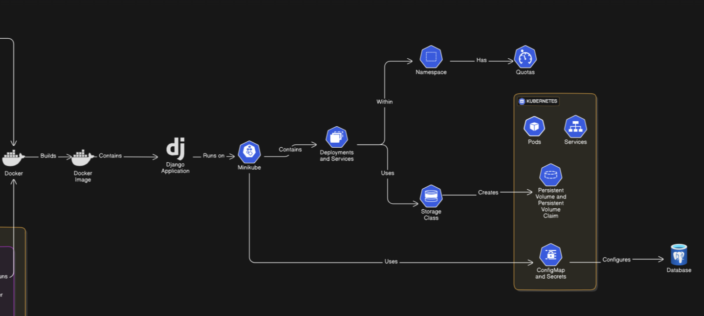

# Shredder Fitness/Nutrition Planner and AWS Scalable Cloud Architecture
- This is an overview of the Shredder application cloud infrastructure.  The below diagram outlines the AWS cloud architecture and the tools used to deploy that architecture and application.  
<!--  -->
<p style="padding-left: 40px;">
  
</p>


# Table of Contents

1. Shredder Main Web Page [click here](http://add8e5f3a255849c4b372d326f2e0884-1592123511.us-east-1.elb.amazonaws.com/)
2. Shredder AWS Architecture Diagrams
    

<p style="padding-left: 40px;">
  
</p>
<p style="padding-left: 40px;">
  
</p>

3. Shredder Database Diagram

<p style="padding-left: 40px;">
  
</p>

   
3. [GitHub Repos](#github-repos)
     - Original Shredder App Repo [click here](https://github.com/zimmermantr/Shredder)
     - Shredder Infrastructure Repo [click here](https://github.com/zimmermantr/devopsCapstoneInfrastructure/)
     - Shredder Backend Repo [click here](https://github.com/zimmermantr/devopsCapstoneBack/)
     - Shredder Frontend Repo [click here](https://github.com/zimmermantr/devopsCapstoneFront/)
4. [Dockerize Shredder Application](#create-a-docker-image-of-the-shredder-application)
     - [Shredder Dockerfile Front](#shredder-dockerfile-front)
     - [Shredder Dockerfile Back](#shredder-dockerfile-back)
     - [Shredder Docker-Compose File](#docker-compose-configuration)
     - [Build Docker Images](#steps-to-build-docker-images)
5. [Deploy Shredder Infrastructure on AWS Using Terraform](#deploy-shredder-infrastructure-on-aws-using-terraform)
     - [dynamod.tf](#dynamodtf)
     - [eks_cluster.tf](#eks_clustertf)
     - [iam.tf](#iamtf)
     - [lambda.tf](#lambdatf)
     - [load_balancers.tf](#load_balancerstf)
     - [outputs.tf](#outputstf)
     - [providers.tf](#providerstf)
     - [rds.tf](#rdstf)
     - [route53.tf](#route53tf)
     - [s3.tf](#s3tf)
     - [security-groups.tf](#security-groupstf)
     - [sensitive-data.tfvars](#sensitive-datatfvars)
     - [generate_tfvars.sh](#generate_tfvarssh)
     - [variables.tf](#variablestf)
     - [vpc.tf](#vpctf)
6. [Deploy Shredder on Minikube](#deploy-twoge-on-minikube)
     - [Order of Running Files Minikube](#order-of-running-files-minikube)
     - [Kubernetes Yaml Files](#minikube-yaml-files)
          - [secrets.yml](#secretsyml)
          - [namespace.yml](#namespaceyml)
          - [configmap.yml](#configmapyml)
          - [pvc.yml](#pvcyml)
          - [postgres-deployment.yml](#postgres-deploymentyml)
          - [postgres-service.yml](#postgres-serviceyml)
          - [back-deployment.yml](#back-deploymentyml)
          - [back-service.yml](#back-serviceyml)
          - [front-deployment.yml](#front-deploymentyml)
          - [front-service.yml](#front-serviceyml)
          - [nginx-configmap.yml](#nginx-configmapyml)
          - [nginx-deployment.yml](#nginx-deploymentyml)
7. [Continuous Integration and Deployment with GitHub Action](#continuous-integration-and-deployment-with-github-actions)
      - [GitHub Actions Workflow Configuration-Infrastructure](#github-actions-workflow-configuration-infrastructure)
      - [GitHub Actions Workflow Configuration-Backend](#github-actions-workflow-configuration-backend)
      - [GitHub Actions Workflow Configuration-Frontend](#github-actions-workflow-configuration-frontend)
      - [Push CICD to GitHub](#push-cicd-to-github)
      - [Validate Functionality](#validate-functionality)


# Create a Docker Image of the Shredder Application: 
## Shredder Dockerfile Front

The `Frontend/Dockerfile` is responsible for creating a Docker image for the Shredder frontend. This Dockerfile uses the Node.js 15 runtime based on Alpine Linux for its small size and efficiency. Below is the Dockerfile with comments explaining each step:

```Dockerfile
# Dockerfile

# Use a multi-stage build to reduce the final image size and avoid copying unnecessary files like node_modules
# The first stage uses the official Node.js 16 image to build the app
FROM node:16 AS build

# Set the working directory inside the container to /app
# This is where all subsequent commands will be executed
WORKDIR /app

# Copy package.json and package-lock.json files into the working directory
# These files contain the app's dependencies
COPY package.json package-lock.json ./

# Install dependencies listed in package.json using npm
# This step ensures all necessary packages are available for building the app
RUN npm install

# Copy the rest of the application's source code into the container
# This ensures the app's code is available for building
COPY . .

# Run the build script defined in the package.json to build the app
# Typically, this will transpile or bundle the app into the /dist directory
RUN npm run build

# Start a new stage of the multi-stage build to keep only the necessary production files
# This stage uses a lightweight nginx container to serve the app
FROM nginx:alpine

# Copy the built files from the previous build stage to the nginx html directory
# These are the files that nginx will serve
COPY --from=build /app/dist /usr/share/nginx/html

# Copy the custom nginx configuration file into the container
# This config file customizes how nginx serves the app
COPY nginx.conf /etc/nginx/nginx.conf

# Expose port 80 to allow traffic into the container
# Nginx typically listens on this port
EXPOSE 80

# Start nginx in the foreground to serve the app
# The 'daemon off;' option prevents nginx from running as a background service
CMD ["nginx", "-g", "daemon off;"]

```

[Return to Top](#shredder-fitnessnutrition-planner-and-aws-scalable-cloud-architecture)

## Shredder Dockerfile Back

The `Backend/Dockerfile` is responsible for creating a Docker image for the Shredder backend. This Dockerfile uses the python:3-alpine image, which is a minimal image to keep the Docker image lightweight.  Below is the Dockerfile with comments explaining each step:
```Dockerfile
# Dockerfile
# Use the official lightweight Python 3 image based on Alpine Linux
# Alpine is used for its small size and security benefits
FROM python:3-alpine

# Set the working directory inside the container to /app
# All subsequent commands will be run relative to this directory
WORKDIR /app

# Copy the requirements.txt file to the working directory
# This file contains the Python dependencies for the app
COPY requirements.txt /app/

# Install Python dependencies listed in the requirements.txt file
# The --no-cache-dir option ensures pip doesn't store unnecessary files, reducing the image size
RUN pip install --no-cache-dir -r requirements.txt

# Copy the rest of the application's source code into the /app directory
# This includes your application code and configuration files
COPY . /app/

# Expose port 8000 to allow traffic into the container
# The application will listen on this port
EXPOSE 8000

# Set the default command to run the application
# This command first runs database migrations (to apply any new schema changes) and then starts the Django app server
CMD ["sh", "-c", "python manage.py migrate && \
    python manage.py runserver 0.0.0.0:8000"]

```

[Return to Top](#shredder-fitnessnutrition-planner-and-aws-scalable-cloud-architecture)

## Docker Compose Configuration

The `shredder docker-compose.yaml` file defines and orchestrates the multi-container Docker application, including the PostgreSQL database, backend, and frontend services. This configuration ensures that all components of the application are correctly set up, connected, and running with the appropriate dependencies. 

```yaml
# docker-compose.yaml
services:
    # Define the PostgreSQL database service
    database:
        # Use the latest official PostgreSQL image
        image: postgres:latest
        # Name the container "postgres" for easier reference
        container_name: postgres
        # Map the host machine's port (default: 5432) to the container's port 5432
        ports:
            - "${POSTGRES_PORT:-5432}:5432"
        # Load environment variables from a .env file for the database configuration
        env_file:
            - ./.env
        # Define a health check to ensure PostgreSQL is ready to accept connections
        # 'pg_isready' checks if the PostgreSQL server is ready
        healthcheck:
            test: ["CMD-SHELL", "pg_isready -U ${POSTGRES_USER} -d ${POSTGRES_DB}"]
            interval: 10s        # Check the health every 10 seconds
            retries: 5           # Retry up to 5 times if the service is not healthy
            start_period: 30s    # Wait for 30 seconds before starting health checks
            timeout: 5s          # Give each health check 5 seconds to complete
        # Persist PostgreSQL data by mounting a volume
        volumes:
            - postgres-data:/var/lib/postgresql/data/
            # Optionally, load initial SQL scripts to set up the database (commented out for now)
            # - ./init_sql_scripts/init.sql:/docker-entrypoint-initdb.d/init.sql
        # Connect this service to the 'shredder' network
        networks:
            - shredder

    # Define the backend service
    backend:
        # Use the custom backend image 'zimmermantr/shredder_back'
        image: zimmermantr/shredder_back
        # Name the container "backend"
        container_name: backend
        # Load environment variables from the .env file
        env_file:
            - ./.env
        # Map the host machine's port (default: 8000) to the container's port 8000
        ports:
            - "${BACK_PORT:-8000}:8000"
        # Connect this service to the 'shredder' network
        networks:
            - shredder
        # Ensure the backend service starts only after the database is healthy
        depends_on:
            database:
                condition: service_healthy
        # Health check for the backend, ensuring the API is running and responds with 'healthy'
        healthcheck:
            test: ["CMD-SHELL", "wget -qO- http://backend:8000/api/v1/health_check/ | grep 'healthy'"]
            interval: 10s        # Check the health every 10 seconds
            retries: 5           # Retry up to 5 times if the service is not healthy
            start_period: 30s    # Wait for 30 seconds before starting health checks
            timeout: 5s          # Give each health check 5 seconds to complete

    # Define the frontend service
    fronted:
        # Use the custom frontend image 'zimmermantr/shredder_front'
        image: zimmermantr/shredder_front
        # Name the container "frontend"
        container_name: frontend
        # Map the host machine's port (default: 80) to the container's port 80
        ports:
            - "${FRONT_PORT:-80}:80"
        # Connect this service to the 'shredder' network
        networks:
            - shredder
        # Ensure the frontend service starts only after the backend is healthy
        depends_on:
            backend:
                condition: service_healthy
    
# Define the custom 'shredder' network using a bridge driver
networks:
    shredder:
        name: shredder
        driver: bridge

# Define a volume to persist PostgreSQL data
volumes:
    postgres-data: {}


```

[Return to Top](#shredder-fitnessnutrition-planner-and-aws-scalable-cloud-architecture)

##  Steps to Build Docker Images
Run the following command in the appropriate directory.This command does two things: 
--build: Rebuilds the images if any changes are detected.
up: Starts the services defined in your docker-compose.yaml.
```
docker-compose up --build
```
Push Images to DockerHub:

Log in to DockerHub:
```
docker-compose push
```
Then test the app in a browser: 
```
http://localhost:8080
```
To stop the running containers: 
```
docker-compose down
```
# Deploy Shredder Infrastructure on AWS Using Terraform
### dynamod.tf
```tf
# dynamod.tf

# Use DynamoDB for Terraform state locking to ensure consistency in resource provisioning.
# This prevents multiple Terraform processes from making conflicting changes by acquiring a lock on the state.

resource "aws_dynamodb_table" "tf_state_lock" {
  name     = var.dynamodb_name  # The name of the DynamoDB table is defined by the variable 'dynamodb_name'.
  hash_key = "LockID"  # The primary key for the table is 'LockID', which is used to manage locking.

  attribute {
    name = "LockID"  # Defines the attribute 'LockID' in the table, which is a string.
    type = "S"  # The type of 'LockID' is 'S', meaning it is a string.
  }

  billing_mode = "PAY_PER_REQUEST"  # DynamoDB will charge based on the number of requests, rather than a fixed capacity.
  # This is efficient for state locking, as locks are infrequent and lightweight.
}

```
[Return to Top](#shredder-fitnessnutrition-planner-and-aws-scalable-cloud-architecture)

### eks_cluster.tf
```tf
### eks_cluster.tf

# Define the EKS Cluster
resource "aws_eks_cluster" "shredder_eks" {
  name     = var.eks_cluster_name  # The name of the EKS cluster is set using the 'eks_cluster_name' variable.
  role_arn = var.preserve_iam_resources ? aws_iam_role.shredder_eks_role[0].arn : null  # Assigns the IAM role if 'preserve_iam_resources' is true, otherwise it skips creating the cluster.

  # VPC Configuration for the EKS Cluster
  vpc_config {
    subnet_ids         = [aws_subnet.shredder_subnet_public_1.id, aws_subnet.shredder_subnet_private_1.id, aws_subnet.shredder_subnet_public_2.id, aws_subnet.shredder_subnet_private_2.id]  # Specifies the public and private subnets for the EKS cluster.
    security_group_ids = [aws_security_group.shredder_eks_sg.id]  # Associates the security group to the EKS cluster for network management.
  }

  # Enable logging for debugging and auditing
  enabled_cluster_log_types = ["api", "audit", "authenticator", "controllerManager", "scheduler"]  # Enables detailed logs for API, authentication, audit, and cluster events.

  # Optional: Add timeouts to ensure the process doesn't get stuck
  timeouts {
    create = "30m"  # Set a 30-minute timeout for cluster creation.
    delete = "30m"  # Set a 30-minute timeout for cluster deletion.
  }

  # Only create the cluster if the IAM role exists
  count = var.preserve_iam_resources ? 1 : 0  # The cluster is only created if the 'preserve_iam_resources' variable is set to true.
}

# Define the EKS Node Group
resource "aws_eks_node_group" "shredder_node_group" {
  cluster_name    = var.preserve_iam_resources ? aws_eks_cluster.shredder_eks[0].name : null  # Associates the node group with the EKS cluster if 'preserve_iam_resources' is true.
  node_group_name = "${var.eks_cluster_name}-node-group"  # The name of the node group includes the EKS cluster name for easy identification.
  node_role_arn   = var.preserve_iam_resources ? aws_iam_role.eks_node_role[0].arn : null  # Assigns the IAM role for the worker nodes.

  # Specify that the node group depends on the EKS cluster being fully created
  depends_on = [aws_eks_cluster.shredder_eks]  # Ensures the node group is created only after the EKS cluster is fully provisioned.

  # Subnets where the worker nodes will be launched
  subnet_ids = [
    aws_subnet.shredder_subnet_public_1.id, 
    aws_subnet.shredder_subnet_private_1.id, 
    aws_subnet.shredder_subnet_public_2.id, 
    aws_subnet.shredder_subnet_private_2.id
  ]  # Specifies the public and private subnets for launching worker nodes.

  # Scaling configuration for the EKS worker nodes
  scaling_config {
    desired_size = 2  # Specifies the desired number of worker nodes to be 2.
    max_size     = 3  # The maximum number of worker nodes is set to 3.
    min_size     = 1  # The minimum number of worker nodes is set to 1.
  }

  # Optional: Specify instance types (ensure this is compatible with your workload)
  instance_types = ["t2.small"]  # Specifies the EC2 instance type for the worker nodes. 't2.small' is chosen here.

  # Optional: Add timeouts to prevent creation delays
  timeouts {
    create = "30m"  # Set a 30-minute timeout for node group creation.
    delete = "30m"  # Set a 30-minute timeout for node group deletion.
  }

  # Tags for resource management
  tags = {
    Name                                        = "${var.eks_cluster_name}-node"  # Assigns a name tag to the node group for resource identification.
    "kubernetes.io/cluster/${var.eks_cluster_name}" = "owned"  # Tags the node group to indicate it's part of the specified EKS cluster.
  }

  # Only create the node group if the IAM roles exist
  count = var.preserve_iam_resources ? 1 : 0  # The node group is created only if the 'preserve_iam_resources' variable is set to true.
}
```
[Return to Top](#shredder-fitnessnutrition-planner-and-aws-scalable-cloud-architecture)

### iam.tf
```tf
### iam.tf
# EKS IAM Configuration

# IAM Role for EKS Cluster
resource "aws_iam_role" "shredder_eks_role" {
  count = var.preserve_iam_resources ? 1 : 0  # The role is created only if 'preserve_iam_resources' is set to true.
  name  = var.eks_role_name  # The name of the IAM role is specified by the 'eks_role_name' variable.

  assume_role_policy = jsonencode({
    Version = "2012-10-17",
    Statement = [
      {
        Effect = "Allow",
        Principal = {
          Service = "eks.amazonaws.com"  # Grants EKS the permission to assume this role.
        },
        Action = "sts:AssumeRole"  # Allows EKS to assume this IAM role.
      }
    ]
  })
}

# Attach Policies to EKS Cluster Role
resource "aws_iam_role_policy_attachment" "eks_cluster_policy" {
  count      = var.preserve_iam_resources ? 1 : 0  # Attach the policy only if 'preserve_iam_resources' is true.
  policy_arn = "arn:aws:iam::aws:policy/AmazonEKSClusterPolicy"  # Attaches the Amazon EKS Cluster Policy to the role.
  role       = aws_iam_role.shredder_eks_role[0].name  # The role to attach the policy to.
}

resource "aws_iam_role_policy_attachment" "eks_vpc_resource_controller" {
  count      = var.preserve_iam_resources ? 1 : 0
  policy_arn = "arn:aws:iam::aws:policy/AmazonEKSVPCResourceController"  # Attaches the VPC Resource Controller Policy.
  role       = aws_iam_role.shredder_eks_role[0].name
}

# IAM Role for EKS Worker Nodes
resource "aws_iam_role" "eks_node_role" {
  count = var.preserve_iam_resources ? 1 : 0
  name  = var.eks_node_role_name  # The IAM role for the worker nodes, controlled by the 'eks_node_role_name' variable.

  assume_role_policy = jsonencode({
    Version = "2012-10-17",
    Statement = [
      {
        Effect = "Allow",
        Principal = {
          Service = "ec2.amazonaws.com"  # Allows EC2 (EKS nodes) to assume this role.
        },
        Action = "sts:AssumeRole"
      },
      {
        Effect = "Allow",
        Principal = {
          AWS = concat([var.ec2_linux_iam_arn], var.standard_user_arns)  # Specifies additional roles allowed to assume this role.
        },
        Action = "sts:AssumeRole"
      }
    ]
  })
}

# Attach Managed Policies to EKS Worker Node Role
locals {
  node_role_policies = [
    "arn:aws:iam::aws:policy/AmazonEC2ContainerRegistryReadOnly",  # Allows the worker nodes to pull images from ECR.
    "arn:aws:iam::aws:policy/AmazonEKS_CNI_Policy",  # Allows the worker nodes to manage the networking of Kubernetes Pods.
    "arn:aws:iam::aws:policy/AmazonEKSWorkerNodePolicy",  # Grants basic permissions for the worker nodes in an EKS cluster.
    "arn:aws:iam::aws:policy/AmazonSSMManagedInstanceCore"  # Allows access to EC2 instances via Systems Manager.
  ]
}

resource "aws_iam_role_policy_attachment" "eks_node_policies" {
  count      = var.preserve_iam_resources ? length(local.node_role_policies) : 0  # Attaches the policies only if IAM roles are preserved.
  policy_arn = local.node_role_policies[count.index]  # Attaches each policy from the 'node_role_policies' list.
  role       = aws_iam_role.eks_node_role[0].name  # Attaches the policies to the worker node IAM role.
}

# Custom Policy for EKS Cluster Autoscaling
resource "aws_iam_policy" "cluster_autoscaler_policy" {
  name        = "ClusterAutoscalerPolicy"  # The name of the custom IAM policy.
  description = "Policy for EKS Cluster Autoscaler"  # A description of what this policy does.

  policy = jsonencode({
    Version = "2012-10-17",
    Statement = [
      {
        Effect = "Allow",
        Action = [
          "autoscaling:DescribeAutoScalingGroups",
          "autoscaling:DescribeAutoScalingInstances",
          "autoscaling:UpdateAutoScalingGroup",
          "autoscaling:SetDesiredCapacity",
          "autoscaling:TerminateInstanceInAutoScalingGroup",
          "ec2:DescribeInstances",
          "ec2:DescribeTags"
        ],  # Grants permissions for the autoscaler to interact with Auto Scaling Groups and EC2 instances.
        Resource = "*"
      }
    ]
  })

  lifecycle {
    ignore_changes = [tags]  # Ignores changes to tags to avoid unnecessary updates.
  }
}

# Custom Policy for EKS EBS Management
resource "aws_iam_policy" "cluster_ebs_policy" {
  name        = "ClusterEBSPolicy"  # The name of the custom policy for managing Elastic Block Storage (EBS) volumes.
  description = "Policy for EBS management in the cluster"

  policy = jsonencode({
    Version = "2012-10-17",
    Statement = [
      {
        Effect = "Allow",
        Action = [
          "ec2:CreateVolume",
          "ec2:AttachVolume",
          "ec2:DeleteVolume",
          "ec2:DescribeVolumes",
          "ec2:DescribeVolumeStatus",
          "ec2:ModifyVolume",
          "ec2:CreateTags"
        ],  # Grants permissions to manage EBS volumes, such as creating, attaching, and deleting volumes.
        Resource = "*"
      }
    ]
  })

  lifecycle {
    ignore_changes = [tags]  # Ignores changes to tags to avoid unnecessary updates.
  }
}

# Attach Custom Policies to EKS Node Role
resource "aws_iam_role_policy_attachment" "cluster_autoscaler_policy_attachment" {
  count      = var.preserve_iam_resources ? 1 : 0  # Attaches the autoscaler policy if IAM resources are preserved.
  policy_arn = aws_iam_policy.cluster_autoscaler_policy.arn  # Attaches the custom autoscaler policy to the worker node role.
  role       = aws_iam_role.eks_node_role[0].name
}

resource "aws_iam_role_policy_attachment" "cluster_ebs_policy_attachment" {
  count      = var.preserve_iam_resources ? 1 : 0  # Attaches the EBS management policy if IAM resources are preserved.
  policy_arn = aws_iam_policy.cluster_ebs_policy.arn  # Attaches the custom EBS policy to the worker node role.
  role       = aws_iam_role.eks_node_role[0].name
}

# Policy detachment handlers
resource "null_resource" "detach_autoscaler_policy" {
  count = var.preserve_iam_resources ? 1 : 0  # Detach autoscaler policy when the resource is destroyed.
  
  triggers = {
    role_name  = aws_iam_role.eks_node_role[0].name
    policy_arn = aws_iam_policy.cluster_autoscaler_policy.arn
  }

  provisioner "local-exec" {
    command = "aws iam detach-role-policy --role-name ${self.triggers.role_name} --policy-arn ${self.triggers.policy_arn}"  # Detach the autoscaler policy.
    when    = destroy
  }

  depends_on = [aws_iam_role_policy_attachment.cluster_autoscaler_policy_attachment]
}

resource "null_resource" "detach_ebs_policy" {
  count = var.preserve_iam_resources ? 1 : 0  # Detach EBS policy when the resource is destroyed.
  
  triggers = {
    role_name  = aws_iam_role.eks_node_role[0].name
    policy_arn = aws_iam_policy.cluster_ebs_policy.arn
  }

  provisioner "local-exec" {
    command = "aws iam detach-role-policy --role-name ${self.triggers.role_name} --policy-arn ${self.triggers.policy_arn}"  # Detach the EBS policy.
    when    = destroy
  }

  depends_on = [aws_iam_role_policy_attachment.cluster_ebs_policy_attachment]
}
```
[Return to Top](#shredder-fitnessnutrition-planner-and-aws-scalable-cloud-architecture)

### lambda.tf
```tf

### lambda.tf

# Add Lambda functions for creating automated backups and EventBridge rules for scheduling.

# Define the AWS Lambda function for RDS snapshot creation
resource "aws_lambda_function" "rds_snapshot" {
  function_name = var.lambda_function_name  # The name of the Lambda function is set via the 'lambda_function_name' variable.
  role          = var.lambda_execution_role_name  # Specifies the IAM role that Lambda will assume, which allows it to perform the necessary actions.
  handler       = var.lambda_handler  # Defines the entry point of the Lambda function (for example, "index.handler").
  runtime       = var.lambda_runtime  # Specifies the runtime environment for the Lambda function (e.g., 'python3.8').
  s3_bucket     = var.lambda_code_bucket  # The S3 bucket where the Lambda function code is stored.
  s3_key        = var.lambda_code_key  # The key (file path) for the Lambda function code in the S3 bucket.

  # Define environment variables to pass to the Lambda function
  environment {
    variables = {
      DB_INSTANCE_IDENTIFIER = aws_db_instance.postgresql.id  # Passes the RDS instance identifier as an environment variable to Lambda.
    }
  }
}

# Create a CloudWatch Event Rule to trigger Lambda at midnight
resource "aws_cloudwatch_event_rule" "midnight_event" {
  name                = "MidnightSnapshotRule"  # The name of the CloudWatch Event Rule.
  schedule_expression = "cron(0 0 * * ? *)"  # Sets a cron schedule to trigger the Lambda function every day at midnight UTC.
}

# Set up CloudWatch Event Target to trigger the Lambda function
resource "aws_cloudwatch_event_target" "lambda_target" {
  rule      = aws_cloudwatch_event_rule.midnight_event.name  # Links the CloudWatch rule to this target (the Lambda function).
  target_id = "RdsSnapshotLambda"  # Assigns a unique identifier for this event target.
  arn       = aws_lambda_function.rds_snapshot.arn  # The Amazon Resource Name (ARN) of the Lambda function that will be triggered.
}

# Allow CloudWatch Events to invoke the Lambda function
resource "aws_lambda_permission" "allow_eventbridge" {
  statement_id  = "AllowExecutionFromEventBridge"  # A unique identifier for this permission statement.
  action        = "lambda:InvokeFunction"  # Allows the Lambda function to be invoked by CloudWatch Events.
  function_name = aws_lambda_function.rds_snapshot.function_name  # Specifies which Lambda function this permission applies to.
  principal     = "events.amazonaws.com"  # Grants permissions to CloudWatch Events to trigger the Lambda function.
  source_arn    = aws_cloudwatch_event_rule.midnight_event.arn  # Limits the permission to the specific CloudWatch Event Rule created earlier.
}

```
### load_balancers.tf


```tf
# Load Balancer for EKS Nodes
resource "aws_lb" "shredder_alb" {
  name               = var.alb_name  # The name of the Application Load Balancer (ALB) is defined by the variable 'alb_name'.
  internal           = false  # This ALB is external (accessible from outside the VPC), set to 'false'.
  load_balancer_type = "application"  # Specifies the type of load balancer as an Application Load Balancer (ALB).
  security_groups    = [aws_security_group.shredder_eks_sg.id]  # Attaches the security group for the EKS cluster to the ALB.
  subnets            = [  # Specifies the public subnets where the ALB will be deployed.
    aws_subnet.shredder_subnet_public_1.id,
    aws_subnet.shredder_subnet_public_2.id
  ]
}

# Define the Target Group for the backend services
resource "aws_lb_target_group" "backend_target_group" {
  name        = var.target_group_name  # The name of the target group is set by the 'target_group_name' variable.
  port        = var.target_group_port  # The port that the target group will use is specified by 'target_group_port'.
  protocol    = "HTTP"  # Specifies that the target group will use the HTTP protocol.
  vpc_id      = aws_vpc.shredder_vpc.id  # Associates the target group with the VPC where the EKS cluster is located.
  target_type = "ip"  # The target type is set to 'ip', meaning it will route traffic based on IP addresses.
}

# Define the Listener for the Load Balancer
resource "aws_lb_listener" "shredder_listener" {
  load_balancer_arn = aws_lb.shredder_alb.arn  # Associates the listener with the Application Load Balancer (ALB) created earlier.
  port              = var.listener_port  # Specifies the listener port, which is set by the 'listener_port' variable.
  protocol          = "HTTP"  # The listener will handle HTTP traffic.

  default_action {
    type             = "forward"  # The action taken by the listener is to forward traffic to a target group.
    target_group_arn = aws_lb_target_group.backend_target_group.arn  # Specifies the target group to forward traffic to.
  }
}

```
[Return to Top](#shredder-fitnessnutrition-planner-and-aws-scalable-cloud-architecture)

### outputs.tf
```tf
### outputs.tf

# Output the VPC ID
output "vpc_id" {
  description = "The ID of the VPC"  # Describes what this output represents.
  value       = aws_vpc.shredder_vpc.id  # The value is the ID of the VPC created by the 'shredder_vpc' resource.
}

# Output the S3 bucket name used for Terraform state
output "s3-bucket-name" {
  description = "The S3 Bucket Name"  # Describes what this output represents.
  value       = aws_s3_bucket.tf_s3_state.bucket  # Outputs the name of the S3 bucket used for Terraform state storage.
}

# Output the S3 bucket's ARN (Amazon Resource Name)
output "s3-arn" {
  description = "The s3 State ARN"  # Describes what this output represents.
  value       = aws_s3_bucket.tf_s3_state.arn  # Outputs the ARN of the S3 bucket used for Terraform state.
}

# Output the EKS Node Group Name
output "eks_node_group_name" {
  description = "The EKS Node Group"  # Describes what this output represents.
  value       = var.preserve_iam_resources ? aws_eks_node_group.shredder_node_group[0].node_group_name : null  # Outputs the name of the EKS node group if IAM resources are preserved.
}

# Output the EKS Cluster Endpoint URL
output "eks_cluster_endpoint" {
  description = "The EKS Cluster Endpoint"  # Describes what this output represents.
  value       = var.preserve_iam_resources ? aws_eks_cluster.shredder_eks[0].endpoint : null  # Outputs the endpoint of the EKS cluster if IAM resources are preserved.
}

# Output the DNS name of the Application Load Balancer (ALB)
output "load_balancer_dns_name" {
  description = "The Load Balancer DNS Name"  # Describes what this output represents.
  value       = aws_lb.shredder_alb.dns_name  # Outputs the DNS name of the Application Load Balancer.
}

# Output the DNS name of the ALB (duplicate but with a different label)
output "alb_dns_name" {
  description = "The DNS name of the Application Load Balancer"  # Describes what this output represents.
  value       = aws_lb.shredder_alb.dns_name  # Outputs the DNS name of the Application Load Balancer.
}

# Output the ARN (Amazon Resource Name) of the ALB
output "alb_arn" {
  description = "The ARN of the Application Load Balancer"  # Describes what this output represents.
  value       = aws_lb.shredder_alb.arn  # Outputs the ARN of the Application Load Balancer.
}

# Commented outputs for RDS (optional)
# output "rds_endpoint" {
#   description = "The RDS Endpoint"  # Describes the RDS endpoint.
#   value       = aws_db_instance.postgresql.endpoint  # Outputs the endpoint of the RDS instance (currently commented out).
# }

```
[Return to Top](#shredder-fitnessnutrition-planner-and-aws-scalable-cloud-architecture)

### providers.tf
```tf
### providers.tf

# Specifies which region and which AWS account to deploy to
provider "aws" {
  region  = var.aws_region  # Specifies the AWS region to deploy resources to, based on the 'aws_region' variable.
  profile = var.aws_profile  # Specifies the AWS account profile to use for deployment, set via the 'aws_profile' variable.
}

# Ensures AWS will be used as the provider for Terraform
terraform {
  required_providers {
    aws = {
      source  = "hashicorp/aws"  # Specifies the AWS provider source from the HashiCorp registry.
      version = "~> 4.16"  # Specifies the version of the AWS provider to use. This allows for updates within version 4.
    }
  }
}

# Example of how to create an EC2 instance with an existing key pair (commented out)
# resource "aws_instance" "my_instance" {
#   ami           = var.ami_id  # The Amazon Machine Image (AMI) ID for the EC2 instance, defined via a variable.
#   instance_type = var.instance_type  # The instance type (e.g., t2.micro) is specified via the 'instance_type' variable.
#   key_name      = var.ssh_key_name  # The SSH key pair name is specified via the 'ssh_key_name' variable.
# }


```
### rds.tf
```tf
### rds.tf

# Define local values for sanitizing timestamps
locals {
  sanitized_timestamp = replace(replace(replace(replace(timestamp(), ":", ""), "-", ""), "T", ""), "Z", "")  
  # The 'timestamp()' function returns the current time with characters not allowed in snapshot identifiers.
  # The 'replace()' function is used to remove colons (":"), dashes ("-"), "T", and "Z" from the timestamp string to create a sanitized value.
}

# AWS RDS Instance for PostgreSQL
resource "aws_db_instance" "postgresql" {
  identifier         = var.rds_instance_name  # The identifier (name) of the RDS instance, set by the 'rds_instance_name' variable.
  engine             = var.rds_engine  # Specifies the database engine (e.g., 'postgres') from the 'rds_engine' variable.
  engine_version     = var.rds_engine_version  # The version of the database engine to use, provided by 'rds_engine_version'.
  instance_class     = var.rds_instance_class  # The instance class for the database (e.g., 'db.t2.micro'), set via 'rds_instance_class'.
  allocated_storage  = var.rds_allocated_storage  # The amount of storage (in GB) allocated to the database instance.
  username           = var.db_username  # The master username for the RDS instance, set via the 'db_username' variable.
  password           = var.db_password  # The master password for the RDS instance, set via the 'db_password' variable.
  db_name            = var.db_name  # The name of the initial database created when the instance is initialized.
  skip_final_snapshot = false  # Ensures a final snapshot is taken before the RDS instance is deleted.

  # Generate a final snapshot identifier by appending a sanitized timestamp to the specified base identifier.
  final_snapshot_identifier = "${var.final_snapshot_identifier}-${local.sanitized_timestamp}"

  # Assigns security groups to the RDS instance for controlling inbound traffic.
  vpc_security_group_ids = [aws_security_group.shredder_node_sg1.id]
}

# Explanation:
# The 'timestamp()' function returns the current date and time, but includes characters (like ":", "-", "T", "Z") that are not allowed in certain resource names.
# The 'replace()' function is used to remove these disallowed characters from the timestamp to generate a valid identifier for the final snapshot.
# The final snapshot identifier includes a sanitized timestamp to ensure it is unique.

```
[Return to Top](#shredder-fitnessnutrition-planner-and-aws-scalable-cloud-architecture)

### route53.tf
```tf
### route53.tf

# Create a Route 53 Hosted Zone
resource "aws_route53_zone" "shredder_zone" {
  name = var.domain_name  # The domain name for the Route 53 hosted zone is provided by the 'domain_name' variable.
}

# Create a Route 53 Record pointing to the existing Application Load Balancer (ALB)
resource "aws_route53_record" "shredder_record" {
  zone_id = aws_route53_zone.shredder_zone.zone_id  # Associates the Route 53 record with the hosted zone using its Zone ID.
  name    = var.route53_record_name  # The name of the DNS record is set by the 'route53_record_name' variable.
  type    = "A"  # Specifies the type of DNS record. 'A' records map domain names to IPv4 addresses.

  alias {
    name                   = aws_lb.shredder_alb.dns_name  # Points the Route 53 record to the DNS name of the Application Load Balancer.
    zone_id                = aws_lb.shredder_alb.zone_id  # Uses the zone ID of the ALB to correctly route traffic.
    evaluate_target_health = true  # Enables health checks for the ALB, ensuring traffic is only routed to healthy targets.
  }
}

```
### s3.tf
```tf
### s3.tf

# Creates an Amazon S3 bucket for storing Terraform state
resource "aws_s3_bucket" "tf_s3_state" {
  bucket        = var.bucket_name  # The name of the S3 bucket is set using the 'bucket_name' variable.
  force_destroy = true  # Allows the bucket to be deleted even if it contains objects. Use with caution in production environments.
}

# Enables versioning for the S3 bucket
resource "aws_s3_bucket_versioning" "tf_s3_state_versioning" {
  bucket = aws_s3_bucket.tf_s3_state.bucket  # Associates the versioning configuration with the S3 bucket.
  versioning_configuration {
    status = "Enabled"  # Enables versioning, allowing you to keep multiple versions of objects in the bucket.
  }
}

# Configures server-side encryption for the S3 bucket
resource "aws_s3_bucket_server_side_encryption_configuration" "tf_s3_state_encryption" {
  bucket = aws_s3_bucket.tf_s3_state.bucket  # Associates the encryption configuration with the S3 bucket.
  rule {
    apply_server_side_encryption_by_default {
      sse_algorithm = "AES256"  # Specifies AES-256 as the server-side encryption algorithm.
    }
  }
}

# Explanation:
# This configuration creates an S3 bucket for storing Terraform state with versioning enabled and server-side encryption using AES-256.
# - Versioning ensures that previous versions of the state files are retained, allowing recovery in case of accidental changes.
# - Server-side encryption protects the data stored in the S3 bucket by automatically encrypting it with AES-256.

```
[Return to Top](#shredder-fitnessnutrition-planner-and-aws-scalable-cloud-architecture)

### security-groups.tf
```tf
### security_groups.tf

# Security Group for Nodes
resource "aws_security_group" "shredder_node_sg1" {
  description       = "Nodes security group"  # Describes the purpose of this security group.
  name              = var.sg_name  # The name of the security group, provided via the 'sg_name' variable.

  # Ingress rule to allow SSH access (port 22) from any IP
  ingress {
    from_port   = 22  # Allows traffic on port 22 (SSH).
    to_port     = 22
    protocol    = "tcp"  # Specifies TCP as the protocol.
    cidr_blocks = ["0.0.0.0/0"]  # Allows traffic from all IP addresses (use cautiously in production).
  }

  # Ingress rule to allow HTTP traffic (port 80) from any IP
  ingress {
    from_port   = 80  # Allows traffic on port 80 (HTTP).
    to_port     = 80
    protocol    = "tcp"
    cidr_blocks = ["0.0.0.0/0"]
  }

  # Ingress rule to allow HTTPS traffic (port 443) from any IP
  ingress {
    from_port   = 443  # Allows traffic on port 443 (HTTPS).
    to_port     = 443
    protocol    = "tcp"
    cidr_blocks = ["0.0.0.0/0"]
  }

  # Ingress rule to allow PostgreSQL traffic (port 5432) from any IP
  ingress {
    from_port   = 5432  # Allows traffic on port 5432 (PostgreSQL).
    to_port     = 5432
    protocol    = "tcp"
    cidr_blocks = ["0.0.0.0/0"]
  }

  # Ingress rule to allow traffic on port 8000 (commonly used for web apps) from any IP
  ingress {
    from_port   = 8000  # Allows traffic on port 8000.
    to_port     = 8000
    protocol    = "tcp"
    cidr_blocks = ["0.0.0.0/0"]
  }

  # Egress rule to allow all outbound traffic
  egress {
    from_port   = 0  # Allows all outbound traffic.
    to_port     = 0
    protocol    = "-1"  # '-1' indicates all protocols.
    cidr_blocks = ["0.0.0.0/0"]
  }
}

# Security Group for EKS worker nodes
resource "aws_security_group" "shredder_eks_sg" {
  name        = "shredder-eks-sg"  # The name of the EKS security group.
  description = "EKS worker nodes security group"  # A description for the EKS security group.
  vpc_id      = aws_vpc.shredder_vpc.id  # Associates the security group with the specified VPC.

  # Ingress rule to allow TCP traffic between ports 1025 and 65535 (commonly used for ephemeral ports)
  ingress {
    from_port   = 1025  # Allows traffic on ports 1025 to 65535.
    to_port     = 65535
    protocol    = "tcp"  # Specifies TCP as the protocol.
    cidr_blocks = ["0.0.0.0/0"]  # Allows traffic from all IP addresses.
  }

  # Egress rule to allow all outbound traffic
  egress {
    from_port   = 0  # Allows all outbound traffic.
    to_port     = 0
    protocol    = "-1"  # '-1' indicates all protocols.
    cidr_blocks = ["0.0.0.0/0"]
  }
}

```
[Return to Top](#shredder-fitnessnutrition-planner-and-aws-scalable-cloud-architecture)

### sensitive-data.tfvars
```tf
aws_profile="xxx"
aws_region="us-east-1"
ssh_key_name="shredder_key"
public_key_path="/home/xxxx/xxxs"
aws_account_id = "xxxxxx"
ec2_linux_iam_arn = "arn:aws:iam::471112952078:role/eks-node-role"
standard_user_arns=[
"arn:aws:iam::4xxxxx:user/xxx" ,
"arn:aws:iam::4xxxxx:user/xxx", 
"arn:aws:iam::4xxxxx:user/xxx" 
]
```
### generate_tfvars.sh
```bash
#!/bin/bash

# Change to the Terraform project directory
cd /home/user/my_projects/terraform_project/  # Navigate to the specified Terraform project directory.

# Define input and output files (now relative paths)
input_file="variables.tf"  # The input file is 'variables.tf', which contains variable definitions.
output_file="sensitive-data.tfvars"  # The output file is 'sensitive-data.tfvars', where sensitive variables will be written.

# Start the .tfvars file from scratch
echo "# This is the .tfvars file for sensitive variables" > $output_file  # Initialize the output file with a comment.

# Use awk to extract variable names with sensitive = true
awk '
  # When we find a variable declaration, store the variable name
  /variable/ {var=$2}  # If the line contains the keyword "variable", store the second word (the variable name) in the variable 'var'.
  
  # When we find sensitive = true on a line, print the stored variable name to the output file
  /sensitive[[:space:]]*=[[:space:]]*true/ {print var " = \"\"" >> "'"$output_file"'"}
  # If the line contains "sensitive = true", write the variable name to the output file with an empty value.
' $input_file  # Apply this logic to the input file (variables.tf).

# Output a message indicating the operation is complete
echo "Generated $output_file with placeholders for sensitive variables."  # Inform the user that the script has generated the sensitive-data.tfvars file.

```
[Return to Top](#shredder-fitnessnutrition-planner-and-aws-scalable-cloud-architecture)

### variables.tf
```tf
### variables.tf
# Defining variables for reusable and configurable values.

# Provider Variables
variable "aws_region" {
  description = "The AWS region where resources will be created."
  type        = string
  default     = "us-east-1"  # Default AWS region is set to 'us-east-1'.
}

# S3 Bucket Variables
variable "bucket_name" {
  description = "Name of the S3 bucket for Terraform state storage."
  type        = string
  default     = "shredder-tf-state"  # Default name for the S3 bucket used for Terraform state.
}

variable "s3_force_destroy" {
  description = "Flag to allow S3 bucket destruction without requiring empty."
  type        = bool
  default     = true  # Allows S3 bucket to be forcefully destroyed even if it has contents.
}

# AWS Account Profile
variable "aws_profile" {
  description = "Specifies which AWS account to deploy infrastructure."
  type        = string
  default     = "Cassandra"  # AWS profile for deployment.
}

# VPC and Subnet Variables
variable "internet_cidr_block" {
  description = "CIDR block for internet access."
  type        = string
  default     = "0.0.0.0/0"  # CIDR block that allows internet access from all IP addresses.
}

variable "vpc_cidr_block" {
  description = "CIDR block for the VPC."
  type        = string
  default     = "10.0.0.0/16"  # Defines the CIDR block for the VPC.
}

# EKS Cluster Variables
variable "eks_cluster_name" {
  description = "Name of the EKS cluster."
  type        = string
  default     = "shredder-cluster"  # Default name for the EKS cluster.
}

variable "eks_node_group_name" {
  description = "Name of the EKS node group."
  type        = string
  default     = "shredder-node-group"  # Default name for the EKS node group.
}

# IAM Role for EKS Cluster
variable "eks_role_name" {
  description = "Name of the IAM role for the EKS cluster."
  type        = string
  default     = "shredder-eks-cluster-role"  # Default name for the IAM role used by the EKS cluster.
}

variable "eks_role_policy_arns" {
  description = "List of policy ARNs to attach to the IAM role for the EKS cluster."
  type        = list(string)
  default     = [
    "arn:aws:iam::aws:policy/AmazonEKSClusterPolicy",
    "arn:aws:iam::aws:policy/AmazonEKSServicePolicy"
  ]  # Attaches necessary policies for the EKS cluster.
}

# IAM Access Entries for EKS Roles
variable "iam_access_entries" {
  type        = list(string)
  description = "List of IAM principal ARNs that can assume the EKS roles."
  default     = []  # This list is populated from the .tfvars file.
}

# Load Balancer Variables
variable "alb_name" {
  description = "Name of the Application Load Balancer."
  type        = string
  default     = "shredder-alb"  # Name for the Application Load Balancer.
}

# Route 53 Variables
variable "domain_name" {
  description = "The domain name for the Route 53 hosted zone."
  type        = string
  default     = "example.com"  # Replace with your actual domain name.
}

# Lambda Variables
variable "lambda_function_name" {
  description = "Name of the Lambda function."
  type        = string
  default     = "rds_snapshot_lambda"  # Name for the Lambda function.
}

variable "lambda_handler" {
  description = "Handler for the Lambda function."
  type        = string
  default     = "index.handler"  # Specifies the handler for the Lambda function.
}

# DynamoDB Variables
variable "dynamodb_name" {
  description = "Name of the DynamoDB table for Terraform state locking."
  type        = string
  default     = "tf_state_lock"  # Name of the DynamoDB table used for Terraform state locking.
}

# Security Group Variables
variable "sg_name" {
  description = "Security group name."
  type        = string
  default     = "shredder-node-sg1"  # Name of the security group for nodes.
}

# Snapshot Variables for RDS
variable "final_snapshot_identifier" {
  description = "Prefix for the final snapshot to be created when the RDS instance is deleted."
  type        = string
  default     = "shredder-final-snapshot"  # Prefix for the final snapshot.
}

# IAM Resource Preservation
variable "preserve_iam_resources" {
  description = "If true, IAM resources will not be destroyed during terraform destroy."
  type        = bool
  default     = true  # Preserves IAM resources during destruction by default.
}

```
[Return to Top](#shredder-fitnessnutrition-planner-and-aws-scalable-cloud-architecture)

### vpc.tf
```tf
### vpc.tf

# Create a Virtual Private Cloud (VPC) for the infrastructure
resource "aws_vpc" "shredder_vpc" {
  cidr_block = "10.0.0.0/16"  # Defines the CIDR block for the VPC, allowing up to 65,536 IP addresses.
}

# Create a public subnet in Availability Zone us-east-1a
resource "aws_subnet" "shredder_subnet_public_1" {
  vpc_id                  = aws_vpc.shredder_vpc.id  # Associates this subnet with the VPC.
  cidr_block              = "10.0.1.0/24"  # Specifies the IP range for this subnet, allowing 256 IP addresses.
  availability_zone       = "us-east-1a"  # Places the subnet in Availability Zone us-east-1a.
  map_public_ip_on_launch = true  # Automatically assigns public IPs to instances launched in this subnet.

  tags = {
    Name                                    = "shredder-subnet-public-1"  # Name tag for easy identification.
    "kubernetes.io/cluster/shredder-cluster" = "owned"  # Tag for EKS to recognize the subnet.
  }
}

# Create a private subnet in Availability Zone us-east-1a
resource "aws_subnet" "shredder_subnet_private_1" {
  vpc_id            = aws_vpc.shredder_vpc.id  # Associates this subnet with the VPC.
  cidr_block        = "10.0.2.0/24"  # Specifies the IP range for this private subnet.
  availability_zone = "us-east-1a"  # Places the subnet in Availability Zone us-east-1a.

  tags = {
    Name                                    = "shredder-subnet-private-1"  # Name tag for easy identification.
    "kubernetes.io/cluster/shredder-cluster" = "owned"  # Tag for EKS to recognize the subnet.
  }
}

# Create a public subnet in Availability Zone us-east-1b
resource "aws_subnet" "shredder_subnet_public_2" {
  vpc_id                  = aws_vpc.shredder_vpc.id  # Associates this subnet with the VPC.
  cidr_block              = "10.0.3.0/24"  # Specifies the IP range for this public subnet.
  availability_zone       = "us-east-1b"  # Places the subnet in Availability Zone us-east-1b.
  map_public_ip_on_launch = true  # Automatically assigns public IPs to instances launched in this subnet.

  tags = {
    Name                                    = "shredder-subnet-public-2"  # Name tag for easy identification.
    "kubernetes.io/cluster/shredder-cluster" = "owned"  # Tag for EKS to recognize the subnet.
  }
}

# Create a private subnet in Availability Zone us-east-1b
resource "aws_subnet" "shredder_subnet_private_2" {
  vpc_id            = aws_vpc.shredder_vpc.id  # Associates this subnet with the VPC.
  cidr_block        = "10.0.4.0/24"  # Specifies the IP range for this private subnet.
  availability_zone = "us-east-1b"  # Places the subnet in Availability Zone us-east-1b.

  tags = {
    Name                                    = "shredder-subnet-private-2"  # Name tag for easy identification.
    "kubernetes.io/cluster/shredder-cluster" = "owned"  # Tag for EKS to recognize the subnet.
  }
}

# Create an Internet Gateway for VPC
resource "aws_internet_gateway" "shredder_igw" {
  vpc_id = aws_vpc.shredder_vpc.id  # Associates the Internet Gateway with the VPC.
}

# Create a route table for public subnets
resource "aws_route_table" "shredder_public_rt" {
  vpc_id = aws_vpc.shredder_vpc.id  # Associates the route table with the VPC.

  # Define a route to send traffic destined for the internet to the Internet Gateway
  route {
    cidr_block = "0.0.0.0/0"  # Default route for all internet-bound traffic.
    gateway_id = aws_internet_gateway.shredder_igw.id  # Sends traffic through the Internet Gateway.
  }
}

# Associate the public route table with public subnet 1
resource "aws_route_table_association" "shredder_public_rt_assoc_1" {
  subnet_id      = aws_subnet.shredder_subnet_public_1.id  # Associates the route table with public subnet 1.
  route_table_id = aws_route_table.shredder_public_rt.id  # Specifies the route table to associate with the subnet.
}

# Associate the public route table with public subnet 2
resource "aws_route_table_association" "shredder_public_rt_assoc_2" {
  subnet_id      = aws_subnet.shredder_subnet_public_2.id  # Associates the route table with public subnet 2.
  route_table_id = aws_route_table.shredder_public_rt.id  # Specifies the route table to associate with the subnet.
}

```
[Return to Top](#shredder-fitnessnutrition-planner-and-aws-scalable-cloud-architecture)

# Deploy Shredder on Minikube


## Order of Running Files Minikube
```
#  Change directory to the Kubernetes directory:  
```
```
minikube start
kubectl apply -f namespace.yml
kubectl config set-context --current --namespace=shredder
kubectl apply -f secrets.yml
kubectl apply -f configmap.yml
kubectl apply -f pvc.yml
kubectl apply -f postgres-deployment.yml
kubectl apply -f postgres-service.yml
kubectl apply -f back-deployment.yml
kubectl apply -f back-service.yml
kubectl apply -f front-deployment.yml
kubectl apply -f front-service.yml
kubectl	 apply -f nginx-configmap.yml
kubectl apply -f nginx-deployment.yml

```

Then start the application service.
```
minikube service front-service -n shredder
```
The application service will open a browser showing the application front end web page. 


### Test the application for functionality.   

When done, clean up by Minikube: 
```
Minikube stop
```
If done using the Minikube and no longer need the cluster entirely, delete.
```
Minikube delete
```
[Return to Top](#shredder-fitnessnutrition-planner-and-aws-scalable-cloud-architecture)


#### secrets.yml

Removed actual secrets but am including file for documentation. 


```yaml

# secrets.yml
apiVersion: v1  # apiVersion and kind: Define that this resource is a Secret.
kind: Secret
metadata:  #Specifies the name and namespace of the Secret. This allows different secrets to be scoped to particular namespaces, so they are accessible only where needed.
  name: secrets
  namespace: shredder
type: Opaque # Defines the type of secret. Opaque is the default type used for generic data such as passwords or API tokens.
data: # Contains the actual sensitive data, encoded in base64. Kubernetes requires you to base64-encode secret values before storing them in a Secret.

  POSTGRES_USER: xxxx

  POSTGRES_PASSWORD: xxxx
  DATABASE_URL: xxxx
  DB_USER: xxxx
  DB_PASSWORD: xxxx
  DB_HOST: xxxx
  DB_DATABASE: xxxx
  FLASK_ENV: xxxx

  AWS_ACCESS_KEY_ID: xxxx
  AWS_SECRET_ACCESS_KEY: xxxx


---
apiVersion: v1
kind: Secret
metadata:
  name: db-secret
  namespace: shredder
type: Opaque
data:
  DB_USER: xxxx
  DB_PASSWORD: xxxx
  DB_HOST: xxxx
  DB_DATABASE:  xxxx
  POSTGRES_USER: xxxx
  POSTGRES_PASSWORD: xxxx
  DATABASE_URL: xxxx
# You can encode values using echo -n 'your-value' | base64.
# To decode use echo "c29tZXVzZXI=" | base64 --decode
```
#### namespace.yml
```yaml
#namespace.yml
apiVersion: v1  # Specifies the API version for Kubernetes resources. 'v1' is the stable API for core Kubernetes resources.
kind: Namespace  # Declares that this resource is a Namespace, used to organize resources in Kubernetes.
metadata:
  name: shredder  # The name of the Namespace is 'shredder'. This is used to logically group all related resources for the 'shredder' project.

```
#### configmap.yml

```yaml
### configmap.yaml
apiVersion: v1  # Specifies the API version for Kubernetes resources. v1 is the stable version for core resources like ConfigMaps.
kind: ConfigMap  # Declares that this is a ConfigMap resource, used to store key-value pairs for configuration purposes.
metadata:
  name: shredder-config  # The name of the ConfigMap is 'shredder-config'. Other resources (like Pods) can reference this ConfigMap by this name.
  namespace: shredder  # The namespace 'shredder' groups this ConfigMap with other resources in the same logical group.
data:  # This section contains the actual key-value pairs for configuration data.
  database-port: "5432"  # The port on which the PostgreSQL database is listening, which is the standard PostgreSQL port.
  database-host: postgres-service  # The hostname or service name for the PostgreSQL database. In this case, its set to the 'postgres-service', which could be another Kubernetes Service.
  database-name: shredder_db  # The name of the database to be used by the backend application, in this case, 'shredder_db'.
  database-type: postgres  # The type of the database. Here, it's 'postgres', indicating the application is using PostgreSQL.
  allowed-hosts: "*"  # Specifies which hosts are allowed to access the application. '*' allows all hosts (wildcard).
  cors-allow-all-origins: "True"  # Enables Cross-Origin Resource Sharing (CORS) from all origins by setting this to True.
  cors-allowed-origins: "*"  # Specifies the allowed origins for CORS requests. '*' allows requests from any origin.
  csrf-trusted-origins: "http://localhost:8000,http://127.0.0.1:8000"  # Defines trusted origins for CSRF protection. Here, it trusts the localhost and loopback IP addresses.
  debug: "True"  # Enables debug mode for the application. Useful for development but should be disabled in production.
  vite-backend-url: "http://back-service:8000/api/v1/"  # Specifies the URL where the frontend (Vite) should connect to the backend API. This uses the 'back-service' service to route traffic within the Kubernetes cluster.
)
```
[Return to Top](#shredder-fitnessnutrition-planner-and-aws-scalable-cloud-architecture)

#### pvc.yml
```yaml
apiVersion: v1  # Specifies the API version for Kubernetes PersistentVolumeClaim resources. 'v1' is the stable API for core resources.
kind: PersistentVolumeClaim  # Declares that this resource is a PersistentVolumeClaim (PVC), which requests storage from the cluster.
metadata:
  name: db-pvc  # The name of the PVC is 'db-pvc'. This is used to reference the volume in other resources like Deployments.
  namespace: shredder  # Places the PVC in the 'shredder' namespace, grouping it with other related resources.
spec:
  storageClassName: shredder-storage  # Specifies the storage class to be used for this PVC. It defines how storage should be provisioned (e.g., SSD, HDD, etc.).
  resources:
    requests:
      storage: 1Gi  # Requests 1 GiB of storage for the PostgreSQL database. This specifies the amount of persistent storage the PVC will use.
  accessModes:
    - ReadWriteOnce  # The access mode specifies that the volume can be mounted as read-write by a single node at a time.

```
#### postgres-deployment.yml

```yaml
#postgres-deployment.yml
apiVersion: apps/v1  # Specifies the API version for the Deployment resource.
kind: Deployment  # Declares that this is a Deployment, which ensures that a specified number of Pods are running at all times.
metadata:
  name: postgres-deployment  # The name of the Deployment is 'postgres-deployment'.
  namespace: shredder  # The Deployment is placed in the 'shredder' namespace, organizing it with related resources.
spec:
  replicas: 1  # Specifies that only 1 replica (instance) of the PostgreSQL Pod should be running.
  selector:
    matchLabels:  # The label selector helps Kubernetes determine which Pods are managed by this Deployment.
      app: shredder-postgres  # This label is used to select the Pods managed by the Deployment, matching 'app=shredder-postgres'.
  template:  # Defines the Pod template, which specifies how to create new Pods.
    metadata:
      labels:
        app: shredder-postgres  # The label used to identify the Pods created by this Deployment.
    spec:
      containers:
        - name: postgres  # The container is named 'postgres', running PostgreSQL.
          image: postgres:latest  # Uses the latest version of the official PostgreSQL image.
          volumeMounts:
            - name: shredder-storage  # Mounts a persistent storage volume named 'shredder-storage'.
              mountPath: /var/lib/postgresql  # The volume is mounted to the '/var/lib/postgresql' directory, where PostgreSQL stores its data.
          resources:  # Specifies the resource requests and limits for the container.
            requests:
              cpu: "100m"  # The container requests 100 milli-CPUs (0.1 of a CPU) to operate.
              memory: "100Mi"  # The container requests 100Mi of memory to operate.
            limits:
              cpu: "200m"  # The container is limited to using 200 milli-CPUs (0.2 of a CPU).
              memory: "200Mi"  # The container is limited to using 200Mi of memory.
          ports: 
            - containerPort: 5432  # Exposes port 5432, the default port for PostgreSQL.
          env:  # Defines environment variables to configure PostgreSQL.
            - name: POSTGRES_USER
              valueFrom:
                secretKeyRef:  # Refers to a Secret to securely retrieve the PostgreSQL username.
                  name: shredder-secret  # The name of the Secret containing the database credentials.
                  key: postgres-username  # The specific key in the Secret that holds the PostgreSQL username.
            - name: POSTGRES_PASSWORD
              valueFrom:
                secretKeyRef:  # Refers to a Secret to securely retrieve the PostgreSQL password.
                  name: shredder-secret
                  key: postgres-password
            - name: POSTGRES_DB
              valueFrom:
                configMapKeyRef:  # Refers to a ConfigMap to retrieve the name of the database.
                  name: shredder-config  # The name of the ConfigMap containing the database configuration.
                  key: database-name  # The specific key in the ConfigMap that holds the database name.
            - name: PGDATA  # This environment variable tells PostgreSQL to store its data in a specific subdirectory.
              value: /var/lib/postgresql/pgdata  # Configures PostgreSQL to use the subdirectory '/pgdata' within the mounted volume for data.
          
          # A startup probe checks if PostgreSQL is ready to start up successfully.
          startupProbe:
            exec:
              command:
                - sh
                - -c
                - |
                  pg_isready -q -d $POSTGRES_DB -U $POSTGRES_USER  # Checks if PostgreSQL is ready by querying the database with the provided credentials.
            initialDelaySeconds: 10  # Waits 10 seconds before performing the first probe.
            periodSeconds: 20  # The probe is performed every 20 seconds.
            timeoutSeconds: 30  # If PostgreSQL doesn't respond within 30 seconds, the probe fails.
            successThreshold: 1  # The number of consecutive successful probes needed to mark the container as started.
            failureThreshold: 3  # The number of consecutive failures allowed before marking the container as not ready.

          # A readiness probe checks if PostgreSQL is ready to serve traffic.
          readinessProbe:
            exec:
              command:
                - sh
                - -c
                - |
                  pg_isready -q -d $POSTGRES_DB -U $POSTGRES_USER  # Runs the 'pg_isready' command to check if PostgreSQL is ready to accept queries.
            initialDelaySeconds: 30  # Waits 30 seconds before performing the first readiness check.
            periodSeconds: 20  # The readiness check is performed every 20 seconds.
            timeoutSeconds: 10  # If PostgreSQL doesn't respond within 10 seconds, the readiness check fails.
            failureThreshold: 3  # The number of consecutive failures allowed before marking the container as not ready.
      
      volumes:  # Defines the volumes that will be used by the Pod.
        - name: shredder-storage  # The name of the volume, 'shredder-storage', which stores persistent data.
          persistentVolumeClaim:
            claimName: db-pvc  # The volume is backed by a PersistentVolumeClaim (PVC) named 'db-pvc', ensuring that the PostgreSQL data persists across Pod restarts.
```
[Return to Top](#shredder-fitnessnutrition-planner-and-aws-scalable-cloud-architecture)

#### postgres-service.yml
```yaml
#postgres-service.yml
apiVersion: v1  # Specifies the API version for Kubernetes Service resources. 'v1' is the stable version for core resources.
kind: Service  # Declares that this resource is a Service, which exposes the PostgreSQL Pod to other components in the cluster.
metadata:
  name: postgres-service  # The name of the Service is 'postgres-service', used to reference the database.
  namespace: shredder  # Places the Service in the 'shredder' namespace, grouping it with other related resources.
spec:
  selector:  # The label selector used to identify which Pods this Service will route traffic to.
    app: shredder-postgres  # The Service will route traffic to Pods with the label 'app=shredder-postgres', matching the PostgreSQL Pod.
  type: ClusterIP  # 'ClusterIP' exposes the Service only within the Kubernetes cluster, making it accessible to other services within the cluster but not externally.
  ports:
    - protocol: TCP  # Specifies the protocol used by the service, which is TCP, the default for PostgreSQL connections.
      port: 5432  # The port on which the Service will be exposed within the cluster. Port 5432 is the default port for PostgreSQL.
      targetPort: 5432  # The port on the Pod that the Service will forward traffic to, which in this case is also 5432, the default PostgreSQL port.

```

#### back-deployment.yml
```yaml
# back-deployment.yml
apiVersion: apps/v1  # Specifies the API version for the Kubernetes Deployment resource.
kind: Deployment  # Defines the type of resource, which is a Deployment.
metadata:
  name: backend-deployment  # The name of the Deployment, "backend-deployment".
  namespace: shredder  # The namespace where this Deployment will be created, in this case, "shredder".
spec:
  replicas: 1  # Specifies the number of pod replicas to run. Here, it's set to 1 instance of the backend.
  selector:
    matchLabels:
      app: shredder-backend  # Pods created by this Deployment must have the label "app=shredder-backend".
  template:
    metadata:
      labels:
        app: shredder-backend  # Label applied to the Pods created by this Deployment, used for matching and organization.
    spec:
      initContainers:  # Defines an init container that runs before the main application starts.
      - name: init-db  # Name of the init container, responsible for initializing the database.
        image: zimmermantr/shredder_infrastructure:latest  # The Docker image used for the init container.
        command:
          - sh
          - -c
          - |
            # A shell script that waits for PostgreSQL to become ready by continuously checking with pg_isready.
            until pg_isready -h $POSTGRES_HOST -p $POSTGRES_PORT -U $POSTGRES_USER; do 
              echo 'Waiting for PostgreSQL...'; 
              sleep 2; 
            done; 
            # Once PostgreSQL is ready, the script will load data from a SQL backup file.
            echo 'PostgreSQL is ready. Loading data...';
            PGPASSWORD=$POSTGRES_PASSWORD psql -h $POSTGRES_HOST -p $POSTGRES_PORT -U $POSTGRES_USER -d $POSTGRES_DB -f /app/db_backup.sql
        env:  # Environment variables needed for the database connection and configuration.
          - name: POSTGRES_HOST
            valueFrom:
              configMapKeyRef:
                name: shredder-config  # Refers to a ConfigMap for the database host value.
                key: database-host
          - name: POSTGRES_PORT
            valueFrom:
              configMapKeyRef:
                name: shredder-config  # Refers to a ConfigMap for the database port value.
                key: database-port
          - name: POSTGRES_USER
            valueFrom:
              secretKeyRef:
                name: shredder-secret  # Refers to a Secret for the PostgreSQL username.
                key: postgres-username
          - name: POSTGRES_DB
            valueFrom:
              configMapKeyRef:
                name: shredder-config  # Refers to a ConfigMap for the database name.
                key: database-name
          - name: POSTGRES_PASSWORD
            valueFrom:
              secretKeyRef:
                name: shredder-secret  # Refers to a Secret for the PostgreSQL password.
                key: postgres-password
        volumeMounts:
          - name: db-backup
            mountPath: /app  # Mounts the db-backup volume to the /app directory in the init container.
      containers:
        - name: shredder-backend  # The main container for the backend application.
          image: zimmermantr/shredder_back:latest  # Docker image for the backend service.
          ports:
            - containerPort: 8000  # The container exposes port 8000 for the application.
          resources:  # Resource requests and limits for the container.
            requests:
              cpu: "100m"  # Requests 100 milli-CPUs (0.1 of a CPU).
              memory: "128Mi"  # Requests 128Mi of memory.
            limits:
              cpu: "250m"  # Limits the CPU usage to 250 milli-CPUs.
              memory: "256Mi"  # Limits the memory usage to 256Mi.
          env:  # Environment variables required for the backend service.
            - name: POSTGRES_DB
              valueFrom:
                configMapKeyRef:
                  name: shredder-config
                  key: database-name
            - name: POSTGRES_USER
              valueFrom:
                secretKeyRef:
                  name: shredder-secret
                  key: postgres-username
            - name: POSTGRES_PASSWORD
              valueFrom:
                secretKeyRef:
                  name: shredder-secret
                  key: postgres-password
            - name: POSTGRES_PORT
              valueFrom:
                configMapKeyRef:
                  name: shredder-config
                  key: database-port
            - name: DATABASE_HOST
              valueFrom:
                configMapKeyRef:
                  name: shredder-config
                  key: database-host
            - name: DATABASE_TYPE
              valueFrom:
                configMapKeyRef:
                  name: shredder-config
                  key: database-type
            - name: ALLOWED_HOSTS
              valueFrom:
                configMapKeyRef:
                  name: shredder-config
                  key: allowed-hosts
            - name: CORS_ALLOW_ALL_ORIGINS
              valueFrom:
                configMapKeyRef:
                  name: shredder-config
                  key: cors-allow-all-origins
            # The following environment variables are commented out and can be enabled for more advanced CORS/CSRF handling.
            # - name: CORS_ALLOWED_ORIGINS
            #   valueFrom:
            #     configMapKeyRef:
            #       name: shredder-config
            #       key: cors-allowed-origins
            # - name: CSRF_TRUSTED_ORIGINS
            #   valueFrom:
            #     configMapKeyRef:
            #       name: shredder-config
            #       key: csrf-trusted-origins
            - name: DEBUG
              valueFrom:
                configMapKeyRef:
                  name: shredder-config
                  key: debug
            - name: POSTGRES_HOST
              valueFrom:
                configMapKeyRef:
                  name: shredder-config
                  key: database-host
          readinessProbe:  # Readiness probe to check when the backend is ready to serve traffic.
            httpGet:
              path: api/v1/health_check/  # Path to the health check endpoint in the backend service.
              port: 8000  # The port where the backend is running.
            initialDelaySeconds: 15  # Delay before the first probe is initiated.
            periodSeconds: 5  # Time interval between probes.
            timeoutSeconds: 3  # Time to wait before the probe times out.
            successThreshold: 1  # The number of successful checks required to mark the container as ready.
            failureThreshold: 3  # The number of failed checks before marking the container as not ready.
      volumes:
      - name: db-backup  # Defines a volume for the database backup files.
        configMap:
          name: db-backup-configmap  # Refers to a ConfigMap that stores the database backup files.
```

#### back-service.yml


```yaml


# back-service.yml
apiVersion: v1  # Specifies the API version for the Service resource. 'v1' is the stable version for core Kubernetes resources.
kind: Service  # Declares that this is a Service resource.
metadata:
  name: back-service  # Names the Service 'back-service', which allows other resources in the cluster to reference it.
  namespace: shredder  # Assigns the Service to the 'shredder' namespace, isolating it within that logical group in Kubernetes.
spec:
  selector:  # Defines the label that will be used to identify which Pods this Service routes traffic to.
    app: shredder-backend  # Matches Pods with the label 'app=shredder-backend', ensuring the service directs traffic to the correct backend Pods.
  type: ClusterIP  # The 'ClusterIP' type exposes the service only within the cluster, ensuring it's not accessible from outside.
  ports:
  - protocol: TCP  # Specifies that the TCP protocol will be used for communication between the service and the Pods.
    port: 8000  # This is the port that the service will expose inside the cluster.
    targetPort: 8000  # The target port on the Pods that the service forwards traffic to, which in this case is also port 8000.

```
[Return to Top](#shredder-fitnessnutrition-planner-and-aws-scalable-cloud-architecture)

#### front-deployment.yml

```yaml

# front-deployment.yml

apiVersion: apps/v1  # Specifies the API version for Kubernetes Deployment resources. 'apps/v1' is the stable API for managing Deployments.
kind: Deployment  # Declares that this resource is a Deployment, which manages the lifecycle of Pods.
metadata:
  name: front-deployment  # The name of the Deployment is 'front-deployment'.
  namespace: shredder  # The namespace 'shredder' groups this Deployment with other resources in the same logical group.
spec:
  selector:
    matchLabels:  # The label selector helps Kubernetes determine which Pods are managed by this Deployment.
      app: shredder  # This label is used to select the Pods that this Deployment will manage, matching 'app=shredder'.
  replicas: 1  # Specifies that the Deployment should run 1 replica (1 instance) of the frontend Pod.
  template:  # Defines the Pod template, which specifies the configuration used to create new Pods.
    metadata:
      labels:
        app: shredder  # This label identifies the Pods created by this Deployment as part of the 'shredder' app.
    spec:
      containers:
        - name: shredder-frontend  # The name of the container that runs inside the Pod, managing the frontend service.
          image: zimmermantr/shredder_front:latest  # The Docker image for the frontend service. The ':latest' tag indicates it uses the latest image version.
          ports:
            - containerPort: 80  # The container exposes port 80, which is commonly used for HTTP traffic.
          resources:  # Defines the resource requests and limits for the container.
            requests:
              cpu: "100m"  # The container requests 100 milli-CPUs (0.1 of a CPU) to operate.
              memory: "128Mi"  # The container requests 128Mi of memory to operate.
            limits:
              cpu: "250m"  # The container is limited to using 250 milli-CPUs (0.25 of a CPU).
              memory: "256Mi"  # The container is limited to using 256Mi of memory.
          env:  # Defines environment variables that will be injected into the container.
            - name: VITE_RAPID_API_KEY  # The frontend container requires an API key, which is provided via an environment variable.
              valueFrom:
                secretKeyRef:  # Refers to a Kubernetes Secret to securely store sensitive data (the API key).
                  name: shredder-secret  # The name of the Secret that contains the API key.
                  key: vite-rapid-api-key  # The specific key in the Secret that contains the value for 'VITE_RAPID_API_KEY'.
            - name: VITE_BACKEND_URL  # Defines the backend URL that the frontend will use to communicate with the backend service.
              valueFrom:
                configMapKeyRef:  # Refers to a Kubernetes ConfigMap to get configuration data that isn't sensitive.
                  name: shredder-config  # The name of the ConfigMap that contains the backend URL.
                  key: vite-backend-url  # The specific key in the ConfigMap that contains the value for 'VITE_BACKEND_URL'.

```
[Return to Top](#shredder-fitnessnutrition-planner-and-aws-scalable-cloud-architecture)

#### front-service.yml

```yaml
#front-service.yml
apiVersion: v1  # Specifies the API version for Kubernetes Service resources. 'v1' is the stable API for core Kubernetes resources.
kind: Service  # Declares that this is a Service resource, which exposes Pods to the network.
metadata:
  name: front-service  # The name of the Service is 'front-service', used to reference this Service in the cluster.
  namespace: shredder  # Places the Service within the 'shredder' namespace, grouping it with other related resources.
spec:
  selector:  # Defines how the Service selects the Pods to route traffic to.
    app: shredder  # The Service will route traffic to Pods that have the label 'app=shredder', matching the frontend Pods.
  
  # use for Minikube
  type: NodePort  # Exposes the Service on a static port (NodePort) on each Kubernetes node. This is commonly used in Minikube environments for local access.
  
  # use for EKS
  # type: LoadBalancer  # Uncomment this line when deploying on Amazon EKS. It will create an external LoadBalancer to expose the service to the internet.
  
  ports:
    - protocol: TCP  # The protocol used for communication, in this case, TCP.
      port: 80  # The port that the Service will expose within the cluster (Port 80 is the standard HTTP port).
      targetPort: 80  # The target port on the frontend Pods where the traffic will be routed (the Pods are also listening on port 80).
      nodePort: 30888  # A static port (30888) on each node where the Service can be accessed externally. Used in Minikube setups to allow access to the service from outside the cluster.
```

[Return to Top](#shredder-fitnessnutrition-planner-and-aws-scalable-cloud-architecture)
#### nginx-configmap.yml
```yaml
#nginx-configmap.yml
apiVersion: v1  # Specifies the API version for Kubernetes ConfigMap resources. 'v1' is the stable API for core Kubernetes resources.
kind: ConfigMap  # Declares that this resource is a ConfigMap, used to store configuration data in key-value pairs.
metadata:
  name: nginx-config  # The name of the ConfigMap is 'nginx-config'. This can be referenced by other resources to load Nginx configuration.
  namespace: shredder  # The ConfigMap belongs to the 'shredder' namespace, grouping it with related resources.
data:
  default.conf: |  # This key contains the Nginx configuration file.
    server {
        listen 80;  # Instructs Nginx to listen on port 80, the default HTTP port.

        location / {
            proxy_pass http://front-service:80;  # Forwards requests from the root URL (/) to the frontend service, which is running on port 80.
            proxy_http_version 1.1;  # Uses HTTP version 1.1 for proxying requests.
            proxy_set_header Upgrade $http_upgrade;  # Sets the 'Upgrade' header to handle WebSocket upgrades if necessary.
            proxy_set_header Connection 'upgrade';  # Keeps the connection open for WebSocket communication.
            proxy_set_header Host $host;  # Forwards the original 'Host' header to the frontend service.
            proxy_cache_bypass $http_upgrade;  # Bypasses the cache for WebSocket upgrades to ensure a real-time connection.
        }

        location /api/v1/ {
            proxy_pass http://back-service:8000;  # Forwards requests from the /api/v1/ path to the backend service, which is running on port 8000.
            proxy_http_version 1.1;  # Uses HTTP version 1.1 for proxying requests.
            proxy_set_header Upgrade $http_upgrade;  # Sets the 'Upgrade' header to handle WebSocket upgrades for API requests if needed.
            proxy_set_header Connection 'upgrade';  # Keeps the connection open for WebSocket communication on API requests.
            proxy_set_header Host $host;  # Forwards the original 'Host' header to the backend service.
            proxy_cache_bypass $http_upgrade;  # Bypasses the cache for WebSocket upgrades to ensure real-time data exchange with the backend.
        }
    }
```
#### nginx-deployment.yml
```yaml
# nginx-deployment.yml
apiVersion: apps/v1  # Specifies the API version for the Deployment resource.
kind: Deployment  # Declares that this is a Deployment resource, which manages the lifecycle of Pods.
metadata:
  name: nginx-deployment  # The name of the Deployment is 'nginx-deployment'.
  namespace: shredder  # The Deployment is placed in the 'shredder' namespace, grouping it with related resources.
spec:
  replicas: 1  # Specifies that 1 replica (instance) of the Nginx Pod should be running.
  selector:
    matchLabels:  # The label selector helps Kubernetes determine which Pods this Deployment manages.
      app: nginx  # This label identifies the Pods that this Deployment will manage, matching 'app=nginx'.
  template:  # Defines the Pod template used to create new Pods.
    metadata:
      labels:
        app: nginx  # This label is applied to the Pods created by this Deployment, identifying them as part of the Nginx service.
    spec:
      containers:
        - name: nginx  # The container name is 'nginx'.
          image: nginx:latest  # Uses the latest version of the official Nginx Docker image.
          ports:
            - containerPort: 80  # Exposes port 80, which is the standard HTTP port, on the container.
          volumeMounts:
            - name: nginx-config  # Mounts a volume containing the Nginx configuration.
              mountPath: /etc/nginx/conf.d  # The volume is mounted to the '/etc/nginx/conf.d' directory, where Nginx will look for configuration files.
          resources:
            requests:
              cpu: "100m"  # The container requests 100 milli-CPUs (0.1 of a CPU).
              memory: "128Mi"  # The container requests 128Mi of memory.
            limits:
              cpu: "250m"  # The container is limited to using 250 milli-CPUs (0.25 of a CPU).
              memory: "256Mi"  # The container is limited to using 256Mi of memory.
      volumes:
        - name: nginx-config  # Defines a volume that will be mounted to provide the Nginx configuration.
          configMap:
            name: nginx-config  # The volume is populated from the 'nginx-config' ConfigMap, which contains the Nginx configuration file.

---
apiVersion: v1  # Specifies the API version for the Service resource.
kind: Service  # Declares that this resource is a Service, used to expose the Nginx Pods to the network.
metadata:
  name: nginx-service  # The name of the Service is 'nginx-service'.
  namespace: shredder  # The Service is placed in the 'shredder' namespace, grouping it with related resources.
spec:
  type: LoadBalancer  # Specifies that this Service will expose Nginx to the internet via a cloud LoadBalancer.
  ports:
    - port: 80  # The Service listens on port 80 for incoming HTTP traffic.
      targetPort: 80  # The Service forwards traffic to port 80 on the Nginx Pods.
      nodePort: 30889  # The port on each Kubernetes node that the Service will be accessible from (useful for Minikube or local development).
  selector:
    app: nginx  # The Service selects Pods with the label 'app=nginx', routing traffic to the Nginx Pods managed by the Deployment.
```
[Return to Top](#shredder-fitnessnutrition-planner-and-aws-scalable-cloud-architecture)

# Continuous Integration and Deployment with GitHub Actions


## Overview

This project uses GitHub Actions to automate the Continuous Integration (CI) and Continuous Deployment (CD) processes. The workflow is triggered on every push to the `main` branch, building Docker images for both the backend and frontend services, and pushing them to DockerHub.

### GitHub Actions Workflow Configuration-Infrastructure

The following is the YAML configuration for the CI/CD pipeline. This workflow ensures that the latest code changes are automatically built and deployed whenever a push is made to the `main` branch.

```yaml
### ci-cd.yml (Infrastructure)

name: Infrastructure CI/CD Pipeline

on:
  push:
    branches: [ main ]  # Trigger the CI/CD pipeline whenever changes are pushed to the main branch

env:
  DOCKER_USERNAME: ${{ secrets.DOCKER_USERNAME }}  # DockerHub username stored securely in GitHub Secrets
  DOCKER_PASSWORD: ${{ secrets.DOCKERHUB_TOKEN }}  # DockerHub token stored securely in GitHub Secrets
  AWS_REGION: ${{ secrets.AWS_REGION }}  # AWS region from GitHub Secrets where infrastructure is deployed
  K8S_NAMESPACE: ${{ secrets.K8S_NAMESPACE }}  # Kubernetes namespace for resource deployment
  EKS_CLUSTER_NAME: ${{ secrets.EKS_CLUSTER_NAME }}  # EKS cluster name stored in GitHub Secrets

jobs:
  deploy_infrastructure:
    runs-on: ubuntu-latest  # Use the latest Ubuntu OS as the environment for running this job

    steps:
    - name: Checkout code
      uses: actions/checkout@v3  # Check out the latest code from the GitHub repository

    - name: Configure AWS credentials
      uses: aws-actions/configure-aws-credentials@v1  # Configure AWS credentials to allow interaction with AWS services
      with:
        aws-access-key-id: ${{ secrets.AWS_ACCESS_KEY_ID }}  # AWS access key ID stored in GitHub Secrets
        aws-secret-access-key: ${{ secrets.AWS_SECRET_ACCESS_KEY }}  # AWS secret access key stored in GitHub Secrets
        aws-region: ${{ env.AWS_REGION }}  # AWS region is defined in the environment variables

    - name: Set up Kubeconfig
      uses: aws-actions/eks-update-kubeconfig@v1  # Configure kubeconfig to connect to the Kubernetes cluster
      with:
        region: ${{ env.AWS_REGION }}  # AWS region to configure Kubernetes
        cluster-name: ${{ env.EKS_CLUSTER_NAME }}  # Name of the EKS cluster
        role-arn: ${{ secrets.AWS_ROLE_ARN }}  # IAM role for accessing the EKS cluster (optional, based on your setup)

    - name: Deploy Infrastructure to Kubernetes
      run: |
        # Deploy the Kubernetes namespace to logically separate resources
        kubectl apply -f k8s/namespace.yml -n ${{ env.K8S_NAMESPACE }}
        # Deploy all other infrastructure-related resources, excluding the namespace
        kubectl apply -f k8s/ -n ${{ env.K8S_NAMESPACE }} --exclude k8s/namespace.yml

    # Optional: Verify the deployment
    # - name: Verify Infrastructure Deployment
    #   run: |
    #     # Verify successful deployment of statefulsets or deployments in Kubernetes
    #     kubectl rollout status statefulset/postgres -n ${{ env.K8S_NAMESPACE }}

    # Optional: Rollback deployment if it fails
    # - name: Rollback Deployment (on failure)
    #   if: failure()
    #   run: |
    #     # Undo the last deployment and rollback to the previous stable version
    #     kubectl rollout undo deployment/shredder-infrastructure -n ${{ env.K8S_NAMESPACE }}


```
[Return to Top](#shredder-fitnessnutrition-planner-and-aws-scalable-cloud-architecture)
### GitHub Actions Workflow Configuration-Backend
```yml
### ci-cd.yml (Backend)

name: Backend CI/CD Pipeline  # Name of the CI/CD pipeline for the backend

on:
  push:
    branches: [ main ]  # Trigger the pipeline when changes are pushed to the main branch

env:
  DOCKER_USERNAME: ${{ secrets.DOCKER_USERNAME }}  # DockerHub username from GitHub Secrets
  DOCKER_PASSWORD: ${{ secrets.DOCKERHUB_TOKEN }}  # DockerHub token from GitHub Secrets
  AWS_REGION: ${{ secrets.AWS_REGION }}  # AWS region from GitHub Secrets (optional for future use)

jobs:
  backend-test:
    runs-on: ubuntu-latest  # Use the latest version of Ubuntu for the environment

    steps:
    - name: Checkout code
      uses: actions/checkout@v3  # Check out the latest version of the code from the repository

    - name: Set up Python environment
      uses: actions/setup-python@v4  # Set up a Python environment
      with:
        python-version: '3.11'  # Specifies the Python version to use

    - name: Install Python dependencies
      run: |
        python -m venv venv  # Create a Python virtual environment
        source venv/bin/activate  # Activate the virtual environment
        pip install -r requirements.txt  # Install dependencies from requirements.txt

    - name: Set up Docker Buildx
      uses: docker/setup-buildx-action@v1  # Set up Docker Buildx for building multi-platform Docker images

    - name: Login to DockerHub
      uses: docker/login-action@v1  # Log in to DockerHub to push the Docker image
      with:
        username: ${{ secrets.DOCKER_USERNAME }}  # DockerHub username from GitHub Secrets
        password: ${{ secrets.DOCKER_PASSWORD }}  # DockerHub token from GitHub Secrets

    - name: Build and push backend Docker image
      uses: docker/build-push-action@v2  # Build and push the Docker image to DockerHub
      with:
        push: true  # Push the built image to DockerHub
        tags: ${{ secrets.DOCKER_USERNAME }}/shredder_back:${{ github.sha }}  # Tag the image with the commit SHA
        platforms: linux/amd64,linux/arm64  # Build for both amd64 (Windows/Linux) and arm64 (newer Macs)
  

```
[Return to Top](#shredder-fitnessnutrition-planner-and-aws-scalable-cloud-architecture)
### GitHub Actions Workflow Configuration-Frontend
```yml
### ci-cd.yml (Frontend)

name: Frontend CI/CD Pipeline  # Name of the CI/CD pipeline for the frontend

on:
  push:
    branches: [ main ]  # Trigger the pipeline when changes are pushed to the main branch

env:
  DOCKER_USERNAME: ${{ secrets.DOCKER_USERNAME }}  # DockerHub username from GitHub Secrets
  DOCKER_PASSWORD: ${{ secrets.DOCKERHUB_TOKEN }}  # DockerHub token from GitHub Secrets
  AWS_REGION: ${{ secrets.AWS_REGION }}  # AWS region from GitHub Secrets (optional for future use)

jobs:
  frontend-build:
    runs-on: ubuntu-latest  # Use the latest version of Ubuntu for the environment

    steps:
    - name: Checkout code
      uses: actions/checkout@v3  # Check out the latest version of the code from the repository

    - name: Set up Node.js environment
      uses: actions/setup-node@v3  # Set up a Node.js environment
      with:
        node-version: '16'  # Specifies Node.js version 16

    - name: Install frontend dependencies
      run: |
        npm ci  # Installs the necessary Node.js dependencies using a clean install

    - name: Set up Docker Buildx
      uses: docker/setup-buildx-action@v1.3.0  # Set up Docker Buildx for building multi-platform Docker images

    - name: Login to DockerHub
      uses: docker/login-action@v1.10.0  # Log in to DockerHub to push the Docker image
      with:
        username: ${{ secrets.DOCKER_USERNAME }}  # DockerHub username from GitHub Secrets
        password: ${{ secrets.DOCKER_PASSWORD }}  # DockerHub token from GitHub Secrets

    - name: Build and push frontend Docker image
      uses: docker/build-push-action@v2  # Build and push the Docker image to DockerHub
      with:
        push: true  # Push the built image to DockerHub
        tags: ${{ secrets.DOCKER_USERNAME }}/shredder_front:${{ github.sha }}  # Tag the image with the commit SHA
        platforms: linux/amd64,linux/arm64  # Build for both amd64 (Windows/Linux) and arm64 (newer Macs)
        build-args: |
          VITE_RAPID_API_KEY=${{ secrets.VITE_RAPID_API_KEY }}  # Pass the API key as a build argument

```

[Return to Top](#shredder-fitnessnutrition-planner-and-aws-scalable-cloud-architecture)
### Push CICD to GitHub
```
Make a small change to one of your files so that it will push up to Github.  ie. add a comment. 
```
```
git add .
git commit -m 'Commit to run CICD for EKS'
git push
```
Sign into your Github repo and bring up Actions. You can watch the steps of the cicd.yml as the job is processed. You'll see it deploying, but then you also will be able to see if it fails and on what step.  


### Validate functionality

Verify that your jobs finished successfully and also test by viewing your application in a web browser and testing its functionality.


[Return to Top](#shredder-fitnessnutrition-planner-and-aws-scalable-cloud-architecture)

